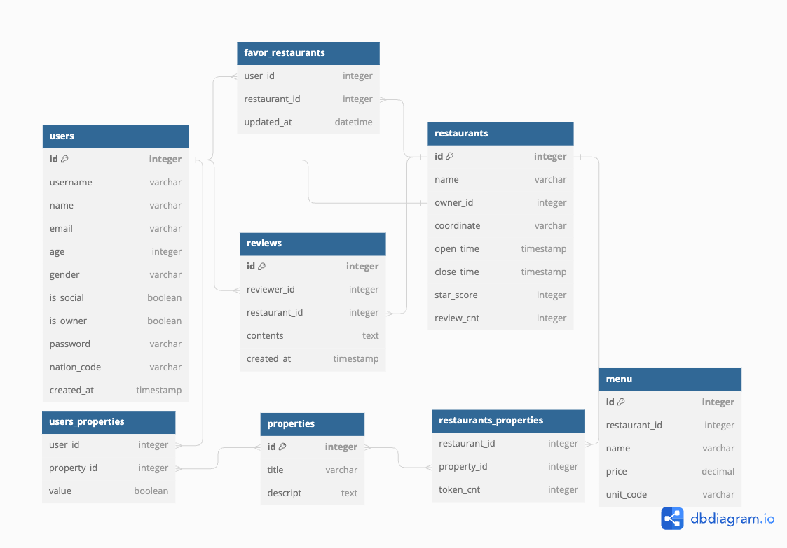
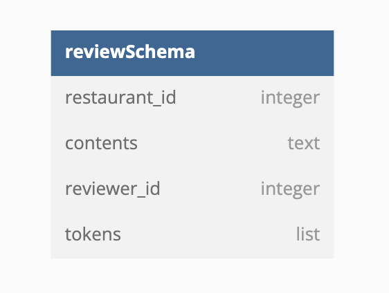

# 플레이버 매치


세계의 많은 사람들의 문화, 종교, 신념, 취향 등이 서로 다르고 더욱 세분화되고 있으나, 이 모든 요구를 수용하는 식당을 찾기 어려워서 이 문제를 해결하기 위해
글로벌 사용자들의 요구를 수용할 수 있는 음식점 추천 어플을 기획함

## 화면 설계


## 기능 명세서

[🧾기능 명세서](https://www.notion.so/4bc09804af7d46649bfa58cbdc06533f?pvs=21)

## 시스템 아키텍처


## ERD




## 개발 환경

### FrontEnd


### BackEnd


### Database


### External library, API


## 서비스 흐름도


## API 목록

api list
=======
### **Views**

| Kind  | URL            | Method | Description                      |
|-------|----------------|--------|----------------------------------|
| View  | `/`            | GET    | 루트 페이지                      |
|       | `/error`       | GET    | 에러 페이지                      |
|       | `/login`       | GET    | 로그인 페이지                    |
|       | `/sign-up`     | GET    | 회원가입 페이지                  |
|       | `/mypage`      | GET    | 개인정보 페이지                  |
|       | `/myreviews`   | GET    | 내가 쓴 리뷰 페이지              |
|       | `/myfavorites` | GET    | 내가 좋아요를 누른 식당 페이지   |
|       | `/restaurants` | GET    | 식당 리스트 정보 페이지          |

---

### **API Endpoints**

| Kind  | URL                                         | Method   | Description                            |
|-------|---------------------------------------------|----------|----------------------------------------|
| API   | `/api/sign-up`                              | POST     | 회원 가입                              |
|       | `/api/login`                                | POST     | 회원 로그인                            |
|       | `/api/auth/social-login`                    | POST     | 회원 소셜 로그인                       |
|       | `/api/mypage/{user-id}`                     | GET      | 회원 정보 조회                          |
|       | `/api/mypage/{user-id}`                     | PUT, PATCH | 회원 정보 수정                        |
|       | `/api/mypage/{user-id}`                     | DELETE   | 회원 탈퇴                              |
|       | `/api/myreviews/{user-id}`                  | GET      | 회원이 작성한 리뷰 리스트 조회         |
|       | `/api/restaurants`                          | POST     | 식당 리스트 검색                       |
|       | `/api/restaurants/{restaurant_id}`          | GET      | 단일 식당 상세정보 조회                |
|       | `/api/myfavorites/{user-id}`                | GET      | 회원 북마크 조회                        |
|       | `/api/{restaurant_id}/reviews`              | GET      | 식당에 연관된 댓글 리스트 조회         |
|       | `/api/{restaurant_id}/reviews`              | POST     | 식당에 연관된 댓글 등록                |
|       | `/api/{restaurant_id}/{restaurant-review-id}` | PUT, PATCH | 식당에 연관된 댓글 수정              |
|       | `/api/{restaurant_id}/{restaurant-review-id}` | DELETE   | 식당에 연관된 댓글 삭제              |

---
### API 사용 방법
#### 회원 가입
##### 엔드포인트 : /api/sign-up
##### Request
```json
{
"id": "flavor-match",
"password": "#######",
"username": "Kim",
"age": "25",
"sex": "male",
"religion": "No",
"language": "kr"
}
```
##### Response
```json
{
  "status": "success",
  "message": "회원가입이 성공적으로 완료되었습니다.",
  "user_id": 12345,
  "registration_date": "2023-09-20"
}
```
---

#### 회원 로그인
##### 엔드포인트  /api/login
##### Request
Method: POST
```json
{
    "username": "닉네임",
    "name": "김커널",
    "email": "kkk@gmail.com",
    "age": 30,
    "gender": "Other",
    "password": "12345678",
    "nation_code": "US"

}
```
##### Response
201 Created
Body:
```json
{
    "status": "success",
    "message": "User successfully registered.",
    "data": {
        "id": "아이디",
        "username": "닉네임",
        "name": "이름",
        "email": "kkk@gmail.com",
        "age": 30,
        "gender": "Other",
        "nation_code": "US"
	}
}
```
---
#### 내 리뷰 리스트 조회
##### 엔드포인트  /api/myreviews/{user-id}
##### Request
Method : GET
Parameter : user_id

##### Response
```json
{
  "status": "success",
  "message": "회원별 리뷰 리스트 호출이 완료되었습니다.",
  "reviews": [
    {
      "restaurant_id": 305,
      "restaurant_review_id": 123498723,
      "star_coount": 5,
      "review_text": "점심시간에 잠깐 다녀온 곳인데 사장님이 친절하고 맛있었어요 ..."
    },
    {
      "restaurant_id": 501,
      "restaurant_review_id": 4564898723,
      "star_coount": 4,
      "review_text": "직장인 가성비 맛집 ..."
    },
    {
      "restaurant_id": 6745,
      "restaurant_review_id": 8797898723,
      "star_coount": 5,
      "review_text": "분위기 좋은 곳 ..."
    }
  ]
}
```

---

#### 내 북마크 조회
##### 엔드포인트  /api/myfavorites/{user-id}/reviews
##### Request
Method: GET
parameter : user_id 리뷰어
##### Response
Body:
```json
{
    "status": "success",
    "data": {
        "restaurants": [
            {
                "user_id": "나",
                "restuarant_id":"솔향기"
                "star_score": 4.7,
                "review_cnt": 320
            },,,,
		]
	}
}
```
---

#### 식당 리뷰 리스트 조회
##### 엔드포인트  /api/{restaurant_id}/reviews
##### Request 
Method: GET
parameter: restaurant_id

##### Response
```json
{
    "status": "success",
    "data": {
        "restaurants": [
            {
                "name": "솔향기",
                "owner_id": "건물주123",
                "coordinate": {
                },
                "open_time": "00:00",
                "close_time": "00:00",
                "star_score": 4.7,
                "review_cnt": 320
            },,,,
		]
	}
}
```

## 참여자
Name : Min son
Like : Coding
Hate : Not Coding
